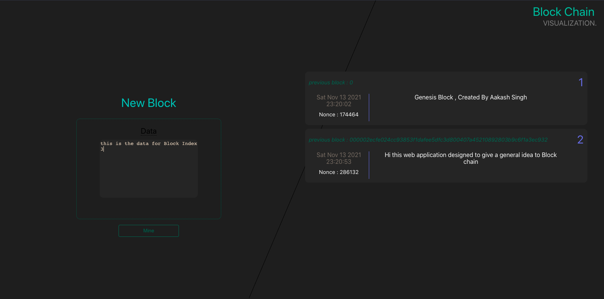

# Blockchain Visualization 
```using React.js and Node.js```

A simple website designed to Manage Credit Card Expenses implemented using Block chain technology.

## For Developers
- clone this repo
- navigate into this project folder
- ```client``` has the front-end code made with react.js
- ```server``` has the backend code made with node.js

### Server Api End Points

```/mineblock```
```/getchain```
```/setDifficulty```
```/getSummary```

### Sneak Peak


